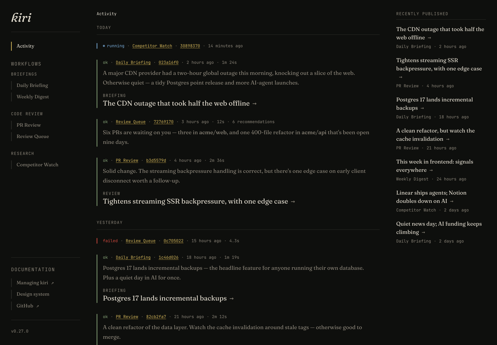

# Kiri

> A local-first, git-based workflow orchestrator for personal automation — with an **activity feed** as the main surface, not a node-graph canvas.

<p align="center">
  
</p>

Kiri is a single local app for running your personal scripts and AI workflows. You define them as YAML in a git repo, invoke them by hand, and watch each run stream into an activity feed — with full traces, published articles, and one-click follow-ups. It runs only while the app is open: no daemons, no scheduler, no cloud.

## What makes it different

- **An activity feed, not a canvas.** Every run — script or AI — streams into one reverse-chronological feed with its status, duration, and a one-line AI summary. The feed *is* the UI; there's no node graph to wire up.
- **Runs become launch pads.** A run can surface one-click follow-up workflows on its detail page — an aggregator that lists your open PRs turns each one into a pre-filled "review this PR" button. No global queue, no inbox: the proposals live on the run that produced them.
- **Long-form output, rendered.** Workflows can publish markdown articles — briefings, code reviews, digests — with inline charts, surfaced in the feed and a "recently published" rail.
- **Local-first and git-based.** Workflows are YAML in your own git repo; runs execute on your machine while the app is open — no daemons, no cloud, no multi-tenancy. Completion-shaped AI steps can call Anthropic, OpenAI, or any OpenAI-compatible endpoint via first-party `llm:` steps; agentic workflows still spawn the Claude Code CLI through script bundles.

## Install

macOS ARM64 only for now — [open an issue](https://github.com/LeeCheneler/kiri/issues) if you'd like another platform.

```sh
brew install LeeCheneler/kiri/kiri
kiri --version
```

Homebrew auto-taps [`LeeCheneler/homebrew-kiri`](https://github.com/LeeCheneler/homebrew-kiri) on first install. To upgrade later, `brew upgrade kiri`.

<details>
<summary>Without Homebrew</summary>

Download the macOS ARM64 binary from the [latest release](https://github.com/LeeCheneler/kiri/releases/latest), make it executable, clear the macOS quarantine flag, and put it on your `$PATH`:

```sh
chmod +x ~/Downloads/kiri
xattr -d com.apple.quarantine ~/Downloads/kiri
sudo mv ~/Downloads/kiri /usr/local/bin/kiri
kiri --version
```

</details>

## Use

Kiri runs per-directory: each working directory is its own workspace.

```sh
cd ~/projects/some-workspace
kiri init    # scaffold a starter workflow
kiri         # boot the orchestrator on :4242
```

To pin a fixed workspace regardless of where you launch from, set `KIRI_CONFIG_DIR` (a leading `~` is expanded). It applies to both `kiri init` and the server:

```sh
KIRI_CONFIG_DIR=~/projects/some-workspace kiri
```

Then open **https://local.kiri.build** in your browser. The hosted shell at that URL loads kiri's UI from your locally-running process. Bookmark it — same URL across machines and projects.

> **Safari / Brave note.** Both browsers block HTTP-localhost subresource loads from an HTTPS page, so the shell won't fetch kiri's bundle there. Use **http://localhost:4242** directly on those browsers. Chrome and Firefox work either way.

`kiri init` scaffolds a minimal **Hello World** workflow — a single inline shell step that runs on first launch with no external tools or LLM provider installed. It declares one input (`name`); clicking **Run** opens a modal to collect it, then echoes a greeting to the feed.

Richer worked examples — bundles that spawn the Claude Code CLI or a local LM Studio model, plus Daily Briefing workflows (bundle-backed and first-party `llm:` variants) that compose a fetch step, a published markdown article, and a summary — live in [`examples/`](./examples/). Copy a bundle into your workspace's `scripts/` when you want agentic steps; copy `llm-providers.yaml` when you want first-party completions.

## Trust model

Kiri runs scripts with **your user's permissions**. Bundles under `scripts/<name>/run.sh` and inline `sh:` steps in your workflow YAML are shell scripts you wrote (or pasted into your own repo) — kiri does not sandbox them. Treat them like any shell script you'd run yourself: read it before you use it.

The defences kiri *does* provide are external: the HTTP API binds to `127.0.0.1` only and requires a custom `X-Kiri-Client` header on state-changing requests, so other browser tabs and arbitrary LAN clients can't trigger workflow runs.

## Learn more

- [`docs/design-notes.md`](./docs/design-notes.md) — architecture, workflows, script bundles, what's shipped, todos.
- [`CONTRIBUTING.md`](./CONTRIBUTING.md) — repo setup, dev workflow, deploying the shell.
